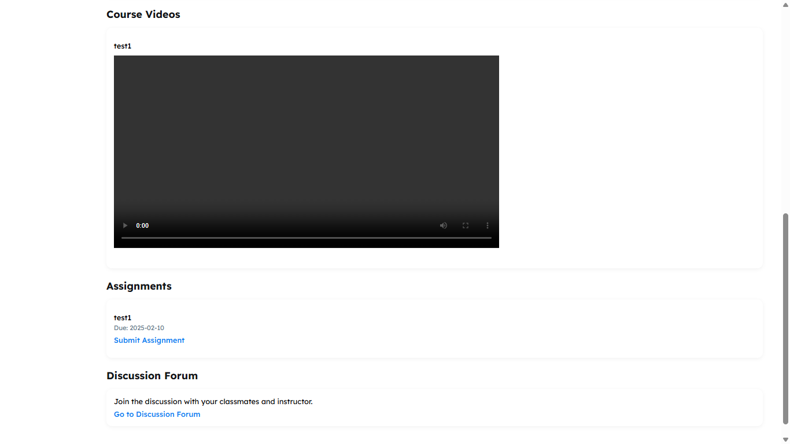

# Online Smart Class (OSC)

[](https://github.com/KrishP08/OSC_php)

## About OSC
**Online Smart Class (OSC)** is a PHP-based e-learning platform designed for students and teachers. It offers a complete learning management system with course management, assignments, quizzes, live lectures, discussion forums, and more.

## Features
### **For Students:**
- Dashboard for course access
- View and enroll in courses
- Watch course videos
- Download course materials
- Submit assignments
- Attempt quizzes
- View grades and results
- Join live lectures
- Participate in discussions and live chat

### **For Teachers:**
- Dashboard to manage courses
- Create and manage quizzes
- Upload course materials and videos
- Assign homework
- Schedule live lectures
- View student submissions
- Evaluate assignments and quizzes
- Communicate via discussion forum and live chat

## Tech Stack
- **Frontend:** HTML, CSS, JavaScript
- **Backend:** PHP
- **Database:** MySQL
- **Other:** AJAX, jQuery
  
# E-Learning Website Screenshots  

## Index & Login  
  
  
  

## Teacher Screenshots  
<details>
  <summary>TAQ</summary>
  
</details>

<details>
  <summary>TCNQ</summary>
  
</details>

<details>
  <summary>TcreateeC</summary>
  
</details>

<details>
  <summary>tD</summary>
  
</details>

<details>
  <summary>TGA</summary>
  
</details>

<details>
  <summary>TQR</summary>
  
</details>

<details>
  <summary>tSLL</summary>
  
</details>

<details>
  <summary>TUCM</summary>
  
</details>

<details>
  <summary>TUCV</summary>
  
</details>

<details>
  <summary>TUDS</summary>
  
</details>

<details>
  <summary>TVS</summary>
  
</details>

## Student Screenshots  
<details>
  <summary>SAC</summary>
  
</details>

<details>
  <summary>SAT</summary>
  
</details>

<details>
  <summary>SCD</summary>
  
  
</details>

<details>
  <summary>SCV</summary>
  
</details>

<details>
  <summary>SD</summary>
  
  
</details>

<details>
  <summary>SDCM</summary>
  
</details>

<details>
  <summary>SLL</summary>
  
</details>

<details>
  <summary>SQR</summary>
  
</details>

<details>
  <summary>SUA</summary>
  
</details>

<details>
  <summary>SVG</summary>
  
</details>

## Installation
1. **Clone the repository**
   ```bash
   git clone https://github.com/KrishP08/OSC_php.git
   cd OSC_php
   ```
2. **Setup the database**
   - Import the `osc.sql` file into MySQL.
   - Update database credentials in `config.php`.

3. **Start the server**
   - Use XAMPP, WAMP, or any PHP-supported local server.
   - Place the project in the `htdocs` folder (if using XAMPP).
   - Start Apache and MySQL.

4. **Access the website**
   Open your browser and visit:
   ```
   http://localhost/OSC_php
   ```

## Future Enhancements
- Add video conferencing for live classes
- Implement AI-based learning recommendations
- Mobile app integration

## License
This project is open-source. Feel free to modify and contribute!

## Contributing
Pull requests are welcome. For major changes, open an issue first to discuss improvements.

## Contact
For any queries, reach out via GitHub Issues or email me at **[7233kp@gmail.com]**.
